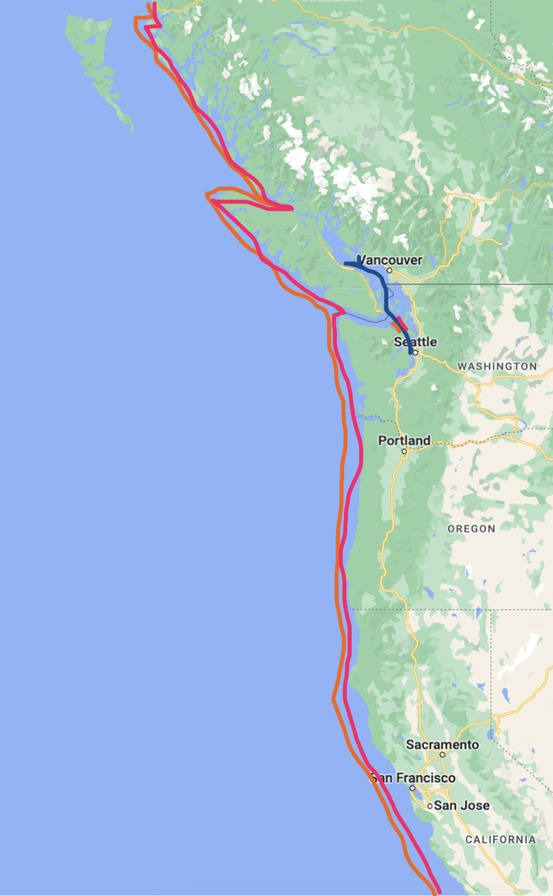
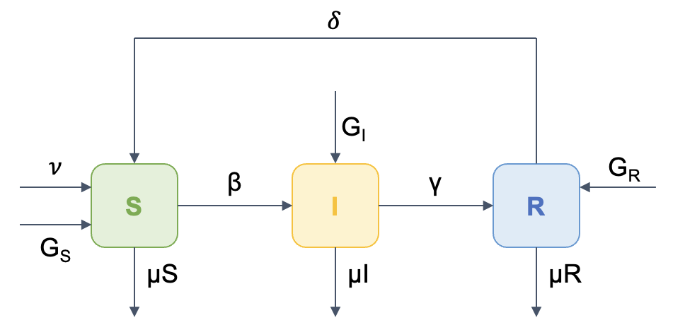
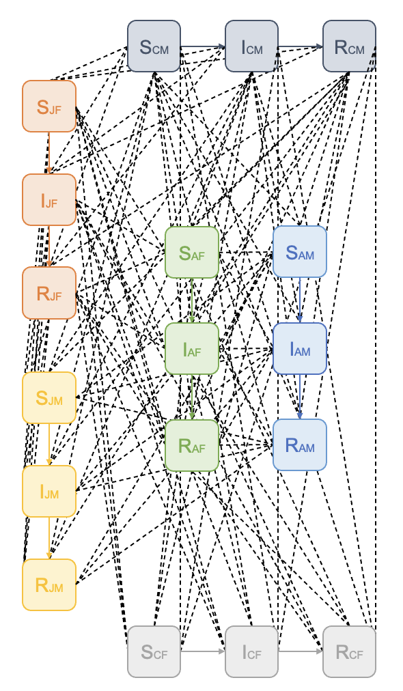

Presentamos un modelo tipo **SIRS** con demografía, con el objetivo de poder modelar el impacto que tendría el que alguna enfermedad infecciosa se transmitiera entre orcas en cautiverio y orcas de vida silvestre.

### Poblaciones

Este modelo representa los patrones de interacción entre individuos de 3 poblaciones de orcas (*Orcinus orca*) residentes del Océano Pacífico, descritas a continuación:

-   Población J: Es la población más reconocida entre las 3 poblaciones. Tiene un total de 25 miembros:

    -   Hembras adultas: 8

    -   Machos adultos: 5

    -   Hembras juveniles: 4

    -   Machos juveniles: 4

    -   Hembras crías: 3

    -   Machos crías: 1

<!-- -->

-   Población K: Es la población más pequeña, pero tiene una mayor distribución, en comparación con la población J. Tiene un total de 16 miembros:

    -   Hembras adultas: 7

    -   Machos adultos: 6

    -   Hembras juveniles: 2

    -   Machos juveniles: 0

    -   Hembras crías: 1

    -   Machos crías: 0

<!-- -->

-   Población L: Es la población grande y tiene una distribución similar a la de la población K. Tiene un total de 35 miembros:

    -   Hembras adultas: 20

    -   Machos adultos: 11

    -   Hembras juveniles: 5

    -   Machos juveniles: 9

    -   Hembras crías: 4

    -   Machos crías: 2

Para la asignación del grupo etario se tomaron en cuenta los siguientes parámetros (Los datos de nacimiento se encuentran en la siguiente página: <https://www.orcaconservancy.org/meet-the-southern-residents>):

-   Adultos: 15 - x (Nacimiento: Hasta 2005)

-   Juveniles: 3 - 15 años (Nacimiento: 2005 - 2020)

-   Crías: 0 - 3 años (Nacimiento: 2020 - 2023)

Las poblaciones de orcas residentes del Océano Pacífico son matriarcados, lo que significa que las hembras son líderes en las poblaciones. En cada población hay familias separadas, cada una centrada en la hembra de mayor edad. Sin embargo, las familias se separan de forma ocasional para socializar.

### Distribución

La distribución de las 3 poblaciones es la siguiente:

{width="309"}

### Modelo simplificado

El esquema por compartimentos simplificado es el siguiente:

{width="455"}

Para ello, asumimos los siguientes supuestos, que deben ser tomados en cuenta al momento de la interpretación de resultados:

-   La población es exacta al momento.

-   No hay tratamiento ni vacunación, debido a que es fauna silvestre.

-   No hay inmunidad de por vida.

-   La demografía es por datos históricos, pero no contempla eventualidades.

### Modelo con distinción de sexo y grupos etarios

Para el modelo final, se tomaron en cuenta 18 compartimentos, los cuales representan cada uno de los 3 estadios contemplados (Susceptible, Infectado, Recuperado), para cada grupo etario y para ambos sexos.

El esquema por compartimentos es el siguiente:

{width="233"}

### Aplicación del modelo

Para aplicar el modelo diseñado (descrito y desarrollado en "Aplicación del modelo"), se escogió a los hongos de la clase zygomycetos. Esto derivado del reciente aumento de infecciones en vida libre, además de las constantes infecciones en orcas en cautiverio.

Los hongos pertenecientes a la división Zygomycota son un grupo de hongos que se caracterizan por poseer hifas anchas, ramificadas, regularmente no septadas y zigosporas. Estos hongos causan infecciones denominadas *zigomicosis* o bien, *mucormicosis,* al tratarse de infecciones del orden de los mucorales. La mucormicosis es frecuentemente observada en mamíferos marinos en cautiverio y puede ser causada por géneros como *Mucor*, *Rhizopus*, *Cunninghamella*, *Apophysomyces*, *Saksenaea*, entre otros.
